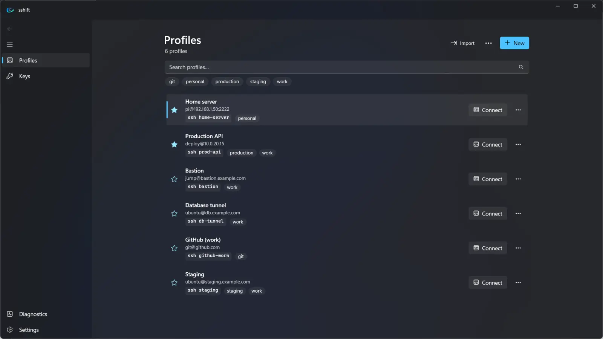

<h1 align="center">sshift</h1>

<b>A Windows-native UI for OpenSSH.</b> Configure visually. Use everywhere.

sshift manages your SSH connections with a native Windows 11 interface and writes them as standard OpenSSH configuration, so every profile also works from any terminal with `ssh <alias>`.

- **Website:** https://jvas28.github.io/sshift
- **Get it:** [Microsoft Store](https://apps.microsoft.com/detail/9NHDFW47LMN1) · USD 6.99 one-time, 7-day free trial
- **Release notes:** [Releases](https://github.com/jvas28/sshift/releases)
- **Support:** [open an issue](https://github.com/jvas28/sshift/issues/new/choose) or see the [support page](https://jvas28.github.io/sshift/support.html)
- **Privacy:** [privacy policy](https://jvas28.github.io/sshift/privacy.html)

This repository hosts the website, release notes and issue tracker. The application source code is not public.

© 2026 Julio Vasconez. All rights reserved.
